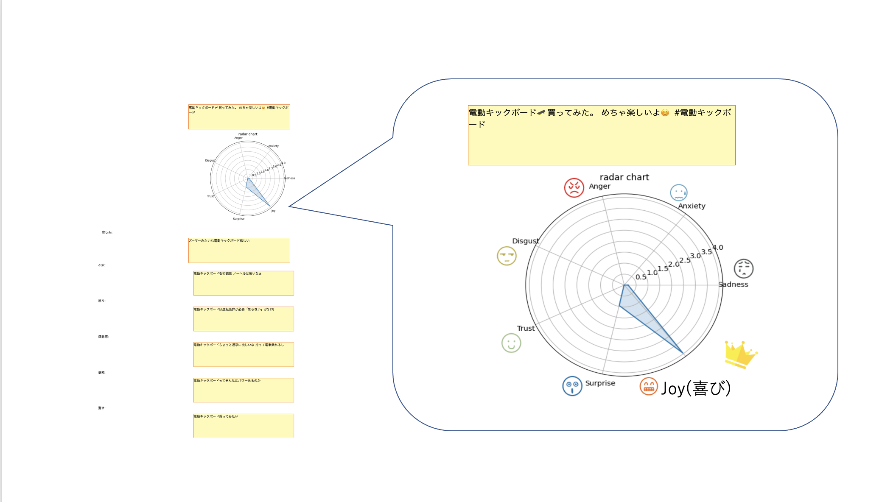
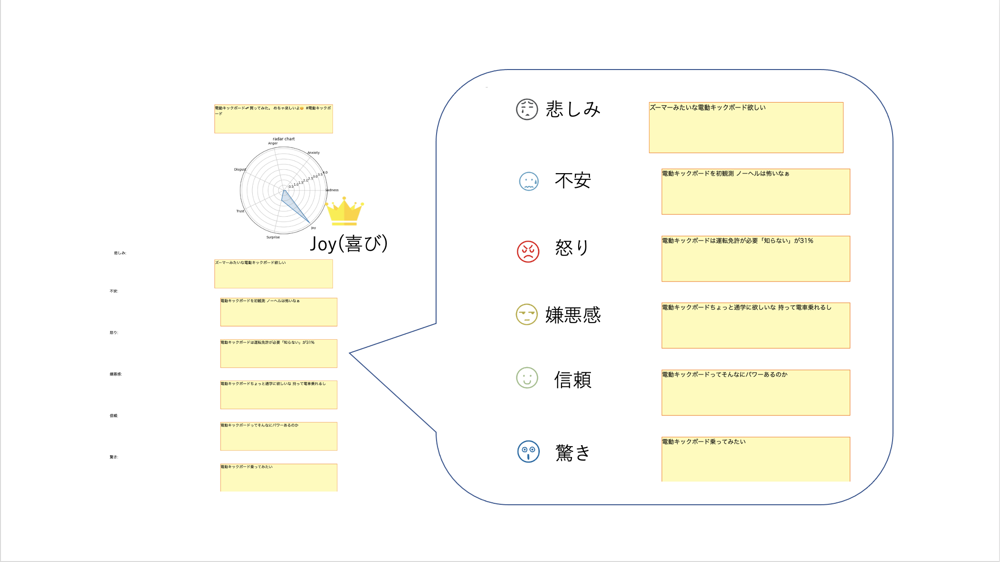

# システムの概要
ある話題に対するツイート100件を提示する。ツイートをボタンを押すことで選択するとそのツイートの感情値をレーダーチャートで表示する。 
感情は、悲しみ、不安、怒り、喜び、嫌悪感、信頼、驚きの7つである。 
レーダーチャートの他に、選択したツイートを代表する感情以外の感情を代表するツイートを表示する。
# 実行例
下記の例では、喜びの感情が一番高いためそれ以外の感情を代表するツイートを表示している。

